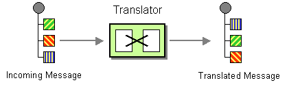
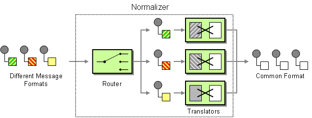

# Routage, transformations et intégration

<!-- .slide: class="page-title" -->


## Sommaire

<!-- .slide: class="toc" -->

- [00 – Agenda](#/0)
- [01 – De la difficulté de définir un ESB](#/1)
- [02 – Comprendre les principes fondamentaux d'un ESB](#/2)
- [03 – L'architecture d'un ESB](#/3)
- [04 – Un ESB Open Source](#/4)
- [05 – Apache ServiceMix](#/5)
- [06 – Apache Camel](#/6)
- [07 – Apache ActiveMq](#/7)
- [08 – Connectivité](#/8)
- **[09 – Routage, transformations et intégration](#/9)**
- [10 – Web Services](#/10)
- [11 – Déployer un environnement de qualité, robuste et fiable](#/11)
- [12 – Surveiller l'ESB : Monitoring métier et technique](#/12)


## Système de messages

- Ces EIP décrivent les briques de base de l'intégration
- Message channel:
  - Comment router des messages d'une application à une autre ?

- Message
  - Quel format donner à nos messages ?
  - Utilisation de l'interface Message que l'on récupère depuis l'Exchange

```java
to("jms:application.out")
```

Notes :


## Système de messages

- **Pipe**
  - Comment faire en sorte de décomposer notre intégration en étapes indépendantes ?

- **Message router**
  - Comment choisir nos étapes en fonction du contenu ?
  - Cf. Content Based Router

```java
from("direct:a").pipeline("direct:x", "direct:y", "direct:z")

from("direct:a").to("direct:x").to("direct:y").to("direct:z")
```

Notes :


## Transformation

Notes :


## Introduction aux EIP de transformation

- Les *Entreprise Integration Patterns* relatifs de transformation de données
  - Transformation de messages d'un format A vers B
  - Un moyen d'éviter les dépendances entre les services
    - Le services émetteur n'a pas forcément besoin de connaître le format du destinataire
    - On peut se baser sur un format commun

Notes :


## EIP – Message Translator

- Comment les services utilisant des formats de données différents peuvent-ils communiquer ensembles ?



Notes :


## EIP – Message Translator

- Cet EIP réalise une transformation des données présentes dans le message pour en former un nouveau
- Plusieurs niveaux de transformation possibles
  - Couche transports (HTTP, JMS, SOAP)
  - Représentation des données (charset, cryptage)
  - Typage des données (noms des champs, types)
  - Couche applications (message, entité)

Notes :


## Camel – Message Translator

- Message Translator en Camel
  - `.transform` + expression
  - `.process` + processor
  - `.bean(Ref)` + POJO
  - `.convertBodyTo` + class
  - `.(un)marshal` + data format (XML, JSON, CSV...)
  - Endpoint XSLT, Freemarker, Velocity, Dozer...

```java
transform(Expression exp)
```

Notes :


## Camel – Message Translator

- Message Translator en Camel
  - Exemple

```java
// processor message translator
from("direct:msgTransProc")
  .process(new WorldProcessor())
  .to("direct:messageTranslatorOut");

// transform message translator
from("direct:msgTransTransf")
  .transform(body().append(" Transform!"))
  .to("direct:messageTranslatorOut");

static class WorldProcessor implements Processor {
  public void process(Exchange exchange) {
   Message in = exchange.getIn();
   in.setBody(in.getBody(String.class) + " World!");
  }
}
```

Notes :


## Camel – Type Converter

- Camel permet simplement de convertir un type vers un autre
- Plus de 150 converter sont disponibles et on peut en ajouter :

```java
// Conversion de File → String
from("file://riders/inbox")
  .convertBodyTo(String.class)
  .to("activemq:queue:inbox");
```

```java
// Ajout du convertisseur de String → Dest avec DestConverter
context.getTypeConverterRegistry()
  .addTypeConverter(Dest.class, String.class, new DestConverter());
```

```java
private static class DestConverter extends TypeConverterSupport {
  public <T> T convertTo(Class<T> type, Exchange exchange, Object value) {
    Dest dest = new Dest(value.toString());
    return (T) dest;
   }
}
```

Notes :


## Camel – Data Format

- Camel propose aussi une interface générique de sérialisation
- Et des implémentations qui permettent la sérialisation depuis/vers des objets (ex : Jaxb)

```java
public interface DataFormat {
  void marshal(Exchange exchange, Object graph, OutputStream stream) throws Exception;
  Object unmarshal(Exchange exchange, InputStream stream) throws Exception;
}
```

```java
from("jms:application.in")
  .unmarshal.jaxb("com.zenika.model") //ContextPath
  .to("direct:process");
```

Notes :


## Camel – Data Format

| Format | Librairie  | Description                                                                       |
|--------|------------|-----------------------------------------------------------------------------------|
| CSV    | Bindy      | Convertit depuis/vers du CSV en utilisant Bindy                                   |
| XML    | JAXB       | Standard Java pour la sérialisation XMl                                           |
| JSON   | Jackson    | Conversion vers le JSON en utilisant Jackson                                      |
| HTML   | TidyMarkup | Facilite l'extraction d'infos depuis des pages html potentiellement mal formatées |


Notes :


## Camel – Template

- On peut aussi utiliser des moteurs de templates :
  - Velocity :
```java
from("activemq:My.Queue").to("velocity:com/zenika/output.vm");
```
  - Freemarker :
```java
from("activemq:My.Queue").to("freemarker:com/zenika/output.ftl");
```
  - XSLT :
```java
from("activemq:My.Queue").to("xslt:com/zenika/output.xsl");
```

Notes :


## Routage

Notes :


## Le Routage

- Un des plus gros défi dans l'intégration est le routage
  - Quelle est la destination finale du message ?
  - Comment acheminer le message à sa destination finale ?
  - Sur quels critères se baser ?

- La destination est un Endpoint (qui peut être associée à un service et à une interface)
  - Endpoint physique (fichier, webservices, file JMS)
  - Endpoint logique (`direct:destination`, `bean:MyService`)

Notes :


## Introduction aux EIP de routage

- Les Entreprise Integration Patterns relatifs au routage
  - Routeurs simples
    - 1 canal d'entrée
    - N canaux de sorties
    - Routage simple

  - Routeurs composés
    - Combinaison de plusieurs routeurs simples
    - Création de routeurs complexes
    - Flux de messages complexes

Notes :


## Introduction aux EIP de routage


Notes :


## Les EIP – Routage de messages

- Fonctionnalités des EIP dédiés au routage de messages
  - Routage basé sur le contenu
  - Routage séquentiel / parallèle
  - Routage statique / dynamique
  - Plan de routage
  - Gestion des processus métiers

Notes :


## EIP – Content Based Router

- **Content Based Router**
  - Comment traiter une situation où l'implémentation d'une seule fonctionnalité est éparpillée sur plusieurs systèmes physiques ?

- Routage basé sur le contenu
- Examine le contenu du message (headers ou body)
  - Existence de champs
  - Valeur de champs


Notes :


## Camel – Content Based Router

- Content Based Router en Camel
  - Permet de faire des choix basés sur des prédicats (conditions à satisfaire pour valider le test)
  - Exemple

```java
from("seda:cbr")
  .choice()
    .when(header("orderType").isEqualTo("gadget"))
      .to("seda:gadgetInventory")

    .when(header("orderType").isEqualTo("widget"))
      .to("seda:widgetInventory")

    .otherwise()
      .to("seda:autre")
  .end();
```

```java
choice().when(Predicate).to(...).otherwise().to(...).end()
```

Notes :


## Camel – Les prédicats

- Ensemble de conditions à évaluer
  - Résultat binaire – vrai ou faux (méthode matches)
  - Très puissant pour créer les critères de routages
  - Support de nombreux langages
    - XPath, XQuery, Python, Groovy, etc.

```java
import org.apache.camel.Predicate;
import org.apache.camel.builder.xml.Namespaces;

Namespaces ns = new Namespaces("ns", "http://esb.resanet.com");
Predicate price = ns.xpath("/ns:order/ns:price/text()='10'");
```

XPath

Notes :


## Camel – Les prédicats

- La classe PredicateBuilder offre les fonctions élémentaires
  - `and`, `or`, `not`, `isLessThan`, `isNull`, `regex`, etc.

```java
import static org.apache.camel.builder.PredicateBuilder.and;
import static org.apache.camel.builder.xml.XPathBuilder.xpath;

Predicate price = xpath("/order/price/text()='10'");
Predicate orderType = header("orderType").isEqualTo("widget");
Predicate body = body().contains("esb");
Predicate priceOrderType = and(price,orderType);
Predicate all = and(body,priceOrderType);
```
Construction de prédicats

Notes :


## TP 7a

<!-- .slide: class="page-tp7a" -->

Notes :


## EIP – Message Filter

- Message Filter
  - Comment éviter qu'un composant reçoive des messages qui ne l'intéressent pas ?

- Filtre les messages pour n'en laisser passer que certains selon un ensemble de critères configurables
- Permet d'éviter de surcharger un système
- Épure les flux de messages


Notes :


## Camel – Message Filter

- Message Filter en Camel
  - Critères de filtrage basé sur les Prédicats

- Exemple

```java
from("direct:filter")
  .filter(header("orderType").isEqualTo("gadget"))
  .to("seda:gadgetInventory");
```

```java
filter(Predicate).to(...)
```

Notes :


## EIP – Recipient List

- Recipient List
  - Comment router un message vers une liste (statique ou dynamique) de destinataires ?


Notes :


## EIP – Recipient List

- Recipient List
  - Deux axes dans cet EIP
    - Calculer la liste des destinataires
    - Router une copie du message entrant vers chacune des destinations

  - Les destinations sont calculées à partir du message d'entrée

Notes :


## Camel – Recipient List (mode statique)

- Recipient List en Camel
  - Critères de routage pré-définis à l'avance

- Exemple

```java
from("direct:input")
  .multicast()
  .to("direct:outputA","direct:outputB");

from("direct:input")
  .multicast().parallelProcessing()
  .to("direct:outputA","direct:outputB");
```

```java
multicast().to(Endpoint, Endpoint, ...)
```

Notes :


## Camel – Recipient List (mode dynamique)

- Recipient List en Camel
  - Critères de routage calculé à l'exécution via une Expression

- Exemple

```java
from("direct:input")
  .recipientList(header("to").tokenize("#"));
```

```java
recipientList(Expression)
```

Notes :


## Camel – Les expressions

- Permet d'évaluer des expressions sur un échange de messages (utilisé par les Prédicats)
  - Résultat complexe (méthode evalutate)
  - Support de nombreux langages
    - Bean, Groovy, Header, Python, SQL, XPath, etc.

```java
...python("requete.headers['user']")...
```

Python

Notes :


## EIP – Routing Slip

- Routing Slip
  - Comment pouvons nous router un message au travers d'une série de destinations, quand la séquence d'appels n'est pas connue à la conception et peut varier selon les messages entrants ?


Notes :


## Camel – Routing Slip

- Routing Slip en Camel
  - Trace une route linéaire dynamiquement
  - Les destinations doivent être valides et êtres déployées
  - Analyse un header spécifique des messages
  - Ce header contient une liste de destinations (de 1 à n)
  - Destinations séparées par le caractère « , » par défaut
    - il est possible de spécifier le séparateur

  - Les messages sont routés en mode Pipeline

```java
routingSlip(String headerName)
```

Notes :


## Camel – Routing Slip

- Routing Slip en Camel
  - Exemple

```java
// Headers{route = direct:rs1,direct:rs2,direct:rs3}
from("seda:routingslip")
  .routingSlip("route");

ChangeBody cb = new ChangeBody();
from("direct:rs1").bean(cb);
from("direct:rs2").bean(cb);
from("direct:rs3").bean(cb);
```

```java
/**
 * Simple bean qui change le contenu du body.
 */
static public class ChangeBody {
  public String change(@Body String body) {
    return body + body;
  }
}
```

Notes :


## EIP – Routing Slip

- Routing Slip
  - Routage dynamique, sans connaître les routes à la conception
  - Flux de messages efficace – Les messages sont envoyés uniquement aux destinations obligatoires, et les facultatives sont évitées
  - Gestion des ressources – Pas de grand nombre de channels, de routeurs
  - Flexibilité et maintenabilité – Les routes sont simples à changer et à mettre à jour

Notes :


## EIP – Bilan du routage 1 vers N

|                                           | Routage séquentiel                                         | Routage parallèle                          |
|-------------------------------------------|------------------------------------------------------------|--------------------------------------------|
| Message                                   | Le message en sortie du précédent sert d'entrée au suivant | Même message entrée, aggrégation en sortie |
| Routage statique (décrit par la route)    | pipeline                                                   | multicast                                  |
| Routage dynamique (décrit par le message) | routingSlip                                                | recipientList                              |


Notes :


## TP 7 b 

<!-- .slide: class="page-tp7 b" -->

Notes :


## EIP – Dynamic Router

- Dynamic Router
  - Routeur intelligent qui peut se paramétrer via des critères résolus dynamiquement
  - Évite de « hard coder » les règles de routage
  - Un algorithme de contrôle dynamique
    - peut prendre diverses formes
    - varie selon les implémentations
  - Calcule des destinations à l'exécution
  - Possibilité d'algorithmes puissants

Notes :


## EIP – Dynamic Router


Notes :


## Camel – Dynamic Router

- Dynamic Router en Camel
  - Critères de routage calculés dynamiquement via une Expression

- Exemple

```java
public String route(@XPath("/order/id") String orderID) {
  invoked++ ; // variable d'instance de la classe
  if (invoked < 5 ) {
    return "seda:out" + orderID;
  }
  return null ;
}
```

```java
dynamicRouter(Expression)
```

```java
from("direct:dynamicRouter")
 .dynamicRouter(bean(RouterBean.class, "route"));
```

Notes :


## Recipient List vs Dynamic Router

- 2 EIP pour le même travail ?
  - À une différence près !

- Le Recipient List peut calculer dynamiquement l'ensemble des destinations
- Le Dynamic Router calcule dynamiquement la prochaine destination
  - Jusqu'à ce que l'expression renvoie null
  - Il est apparu avec Camel 2.5

Notes :


## TP 7 c 

<!-- .slide: class="page-tp7 c" -->


## EIP – Splitter

- Splitter
  - Comment traiter un message contenant plusieurs parties, chacune d'entre elles pouvant être traitées différemment ?


Notes :


## EIP – Splitter

- Splitter
  - Casse le message d'origine en une série de messages individuels
  - Chaque nouveau message contient une parties des données d'origine
  - Lorsque couplé à un Content Based Router, permet de n'envoyer que les données utiles à un service
  - Il peut être intéressant de conserver un identifiant de corrélation entre les messages splittés

Notes :


## Camel – Splitter

- Splitter en Camel
  - Segmente un message en plusieurs messages

- Exemple

```java
Namespaces ns = new Namespaces("esb","http://esb.resanet.com");
Expression xpathExp = ns.xpath("//esb:order/esb:commande");
from("seda:splitterXPath")
  .split(ns.xpath("//esb:order/esb:commande"))
  .to("seda:splitterXPathOut");

from("seda:splitterRegex")
  .split(body().regexTokenize("d.f"))
  .to("seda:splitterRegexOut");
```

```java
split(Expression).to(Endpoint)
```

Notes :


## Camel – Splitter

- Mise à disposition de plusieurs variables en tant que Propriété de l'Exchange
  - `CamelCorrelationId` : identifiant commun entre tous les morceaux
  - `CamelSplitIndex` : numéro du morceau de message commençant à 0
  - `CamelSplitSize` : le nombre total de messages morcelés jusqu'à présent
  - `CamelSplitComplete` : est-ce que ce message est le dernier ?

- Accès par Annotations `@Property`

Notes :


## EIP – Aggregator

- Aggregator
  - Comment pouvons nous combiner des messages individuels (bien que liés) pour n'en former qu'un seul ?


Notes :


## EIP – Aggregator

- Aggregator
  - Combinaison des messages individuels pour ne former qu'un seul message
  - Collection des messages individuels
  - Stockage des messages individuels
  - Critères de liaisons des messages (identifiant de corrélation, header, valeur calculée)
    - Quels messages entrants sont destinés à être réunis ?

Notes :


## EIP – Aggregator

- Aggregator
  - Critères de complétion de la collection
    - Quand publie-t-on le message résultant ?
    - Nombre de messages reçus
    - Délai d'attente

  - Algorithme d'agrégation
    - Comment réunit-on les messages entrants en un seul message ?

Notes :


## EIP – Aggregator

- Aggregator
  - Critères de complétion de la collection
    - Quand publie-t-on le message résultant ?
    - Nombre de messages reçus
    - Délai d'attente
  - Algorithme d'agrégation
    - Comment réunit-on les messages entrants en un seul message ?
  - EIP statefull
    - Stockage des messages individuels en attendant que l'intégralité des messages soit collectée

Notes :


## Camel – Aggregator

- Aggregator en Camel
  - Agrège plusieurs messages en un seul
  - `AggregationStrategy`
    - Interface permettant d'implémenter l'algorithme d'agrégation

  - AggregatorType
    - Défini les critères de complétion (`batchTimeout`, `batchSize`, `completedPredicate`)

```java
aggregator(Expression, AggregationStrategy).AggregatorType
```

Notes :


## Camel – Aggregator

- Aggregator en Camel
  - `AggregationRepository`
    - Stockage des messages en attente : Memory, JDBC, LevelDB, Hazelcast, Infinispan...

Notes :


## Camel – Aggregator

- Mise à disposition de plusieurs variables en tant que Propriété de l'Exchange
  - `CamelCorrelationId` : pour reformer les morceaux en un seul message
  - `CamelAggregatedSize` : le nombre total de messages aggrégés jusqu'à présent
  - `CamelAggregatedIndex` : numéro du message dans le nombre d'aggrégats

Notes :


## Camel – Aggregator

- AggregationStrategy

```java
public class CSVAggregationStrategy implements AggregationStrategy {

  public Exchange aggregate(Exchange oldEx, Exchange newEx) {
    if (oldEx != null) {
     StringBuilder sb = new StringBuilder();
     sb.append(oldEx.getIn().getBody(String.class));
     sb.append(";");
     sb.append(newEx.getIn().getBody(String.class));
     newEx.getIn().setBody(sb.toString(), String.class);
    }
    return newEx;
  }
}
```

Notes :


## Camel – Aggregator

- Aggregator en Camel
  - Exemple

```java
from("seda:aggregator")
  .aggregator(header("correlation.id"), new CSVAggregationStrategy())
  .batchTimeout(2000L).batchSize(3)
  .to("seda:aggregatorOut");

from("seda:aggregator2")
  .aggregator(header("correlation.id"), new CSVAggregationStrategy())
  .completedPredicate(header(Exchange.AGGREGATED_COUNT).isEqualTo(3))
  .to("seda:aggregatorOut");

from("seda:aggregator3")
  .aggregator(new XMLAggregationStrategy())
  .xpath("/body", String.class).batchSize(4)
  .to("seda:aggregatorOut");

```

Notes :


## EIP – Resequencer

- Resequencer
  - Comment pouvons nous réordonner des messages ayant un lien mais arrivés aléatoirement ?


Notes :


## EIP – Resequencer

- Resequencer
  - Réception d'un flux de messages désordonnés
    - Selon un critère métier (ex : numéro de facture)
    - Selon un critère technique (ex : id de corrélation)

  - Rétention des messages dans un buffer interne (statefull)
  - Publication ordonnée des messages sur le channel de sortie (ce dernier se doit préserver l'ordre)
    - ex : une file JMS avec 1 seul consommateur

  - Comme les autre Routeurs, le Resequencer ne modifie pas (en général) le contenu des messages

Notes :


## Camel – Resequencer

- Resequencer en Camel
  - Réordonne un groupe de messages
  - `ResequencerType`
    - défini les caractéristiques de comparaison, et du processus d'ordonnancement

  - 2 modes d'ordonnancement
    - lot (batch)
    - flux continu (stream)

  - Redéfinition des critères de comparaison

```java
resequencer(Expression).ResequencerType
```

Notes :


## Camel – Resequencer

- Resequencer en Camel
  - Mode batch `.batch()`
    - Collecte un lot de messages avant de le traiter en intégralité selon les critères de comparaison
    - Nécessite de connaître le nombre de messages à l'avance
    - Timeout `.timeout(1000L)`
    - Taille du lot `.size(100)`

  - Mode flux continu `.stream()`
    - Dès que le message suivant est résolu, il est envoyé au channel de sortie
    - Ne nécessite pas de connaître le nombre de messages à l'avance
    - Timeout `.timeout(1000L)`
    - Taille du buffer `.size(100)`

Notes :


## Camel – Resequencer

- Resequencer en Camel
  - Exemples

```java
// batch resequencer
from("direct:resequencer")
  .resequencer(header("priority"))
  .batch().size(2).timeout(1000L)
  .to("direct:resequencerOut");

// stream resequencer
from("direct:resequencer2")
  .resequencer(header("priority"))
  .stream().timeout(1000L).comparator(new ReverseComparator())
  .to("direct:resequencerOut");
```

Notes :


## EIP – Composed Message Processor

- Composed Message Processor
  - Comment pouvons nous maintenir un flux de messages dans sa globalité, alors que les messages sont segmentés et traités par des composants différents ?


Notes :


## EIP – Composed Message Processor

- Composed Message Processor
  - EIP composé qui fait appel à plusieurs EIP déjà explorés
    - Splitter
    - Router (statique ou dynamique)
    - Aggregator

  - Les Pipes et les Filters nous permettent de définir des agrégations de patterns de routage
  - Utilisé pour traiter des messages composés (contenant plusieurs parties distinctes)

Notes :


## EIP – Composed Message Processor

- Composed Message Processor (CMP)
  - Fonctionnement
    - CMP segmente le message en plusieurs éléments distincts (Splitter)
    - Chacun des ces éléments sont routés vers les destinations appropriées, statiquement ou dynamiquement (CBR, Dynamic Router, etc.)
    - Les différentes réponses sont dans un premier temps corrélées, puis agrégées pour ne former qu'un seul message de sortie (Aggregator)

Notes :


## Camel – Composed Message Processor

- Composed Message Processor en Camel
  - Exemple
  - Partie Splitter

```java
// Splitter
from("direct:cmp")
  .splitter(
    body().regexTokenize("d.f"),
    aggregationStrategy)
  .to("direct:cmpCBR");
```

Notes :


## Camel – Composed Message Processor

- Composed Message Processor en Camel
  - Définition des Beans utilitaires, et méthode d'Expression

```java
/**
 * Simple bean qui fait des concaténations.
 */
public class CMPBean {
  public String changeBody1(@Body String body) {
    return body.concat(".changeBody1");
  }
  public String changeBody2(@Body String body) {
    return body.concat(".changeBody2");
  }
}
```

```java
public boolean CBRBeanExpression(@Body String body) {
  return body.startsWith("a");
}
```

Notes :


## Camel – Composed Message Processor

- Composed Message Processor en Camel
  - Partie Content Based Router

```java
// CBR
CMPBean cmpBean = new CMPBean();

from("direct:cmpCBR")
  .choice()

    .when(toPredicate(beanExpression("composedMessageProcessor")))
      .bean(cmpBean, "changeBody1")

    .otherwise()
      .bean(cmpBean, "changeBody2")

  .end()
  .to("direct:cmpAgg");
```

Notes :


## Camel – Composed Message Processor

- Composed Message Processor en Camel
  - Algorithme d'agrégation

```java
/**
 * Algorithme de concaténation des bodies uniquement.
 */
public class ConcatAggregationStrategy implements AggregationStrategy {

  public Exchange aggregate(Exchange oldEx, Exchange newEx) {

    StringBuilder sb = new StringBuilder();
    sb.append(oldEx.getIn().getBody(String.class));
    sb.append("++++++");
    sb.append(newEx.getIn().getBody(String.class));
    newEx.getIn().setBody(sb.toString(), String.class);

    return newEx;
  }
}
```

Notes :


## Camel – Composed Message Processor

- Composed Message Processor en Camel
  - Aggregator

```java
// Aggregator
AggregationStrategy aggregationStrategy = new ConcatAggregationStrategy();

from("direct:cmpAgg")
  .aggregator(as)
  .header("correlation.id")
  .to("direct:cmpOut");
```

Notes :


## EIP – Scatter Gather

- Scatter Gather
  - Comment pouvons nous maintenir un flux de messages dans sa globalité, alors que les messages sont diffusés à de multiples composants, chacun pouvant retourner une réponse ?


Notes :


## EIP – Scatter Gather

- Scatter Gather
  - EIP composé qui fait appel à plusieurs EIP déjà explorés
    - Recipient List
    - Aggregator

  - Utilisé pour diffuser dynamiquement un message vers plusieurs destinataires , et agréger les différentes réponses en un seul message

Notes :


## EIP – Scatter Gather

- Scatter Gather
  - Fonctionnement
    - Diffusion dynamique du message entrant vers une liste de destinataires (Recipient List) (dans les faits, la liste peut être statique, on utilisera alors le multicast, abordé par la suite)
    - Les différentes réponses sont ensuite dans un premier temps corrélées, puis agrégées pour ne former qu'un seul message de sortie (Aggregator)

Notes :


## Camel – Scatter Gather

- Scatter Gather en Camel
  - Exemple

```java
// Aggregator
AggregationStrategy as = new ConcatAggregationStrategy();

// RecipientList
from("direct:scattergather")
  .recipientList(header("catalogue"), as)
  .to("direct:sgOut");
```

Notes :


## Transformation (suite)

Notes :


## EIP – Envelope Wrapper

- Envelope Wrapper
  - Comment les services existants peuvent-ils participer à des échanges de messages qui positionnent des spécificités (comme les headers, cryptage) sur le format du message ?


Notes :


## EIP – Envelope Wrapper

- Envelope Wrapper
  - Cet EIP réalise une encapsulation des données
  - Encapsule les données applicatives dans une enveloppe qui est compatible avec l'infrastructure de messages
    - ex : un message SOAP
    - ex : un message JBI (via le JBIWrapper)

  - L'encapsulation est réalisée à l'émission (ou à l'entrée dans l'infrastructure)
  - L'opération inverse est réalisée quand le message arrive à destination (ou lorsqu'il sort de l'infrastructure)

Notes :


## Camel – Envelope Wrapper

- Envelope Wrapper en Camel
  - Pas d'implémentation d'Envelope Wrapper en Camel
  - En effet, c'est inutile. Camel sait router et acheminer tous types de messages.
    - String
    - Source
    - Stream

Notes :


## EIP – Content Enricher

- Content Enricher
  - Comment communiquer avec une autre service si le message d'origine ne contient pas toutes les données utiles ?


Notes :


## EIP – Content Enricher

- Content Enricher
  - Cet EIP permet d'ajouter des données à un message
  - Les sources des nouvelles données
    - Un calcul réalisé à partir des propres données du message qui ajoute de nouveaux champs
    - Données prélevées dans l'environnement (système, date, etc.)
    - Une source externe (base de données, autre message, LDAP, etc.)

  - Résolution de références contenues dans le message

Notes :


## Camel – Content Enricher

- Content Enricher en Camel
  - Enrichissement du message via une source externe
  - Stratégies :
    - Processor, bean…
    - `.enrich` + producer ou `.pollEnrich` + consumer

```java
// Content enricher
from("direct:contentEnricher")
  .enrich("direct:contentProvider", aggregationStrategy)
  .to("direct:contentEnricherOut");
```

Notes :


## EIP – Content Filter

- Content Filter
  - Comment pouvons-nous traiter un message avec beaucoup de données, alors que seule une petite partie de ces données nous intéresse ?


Notes :


## EIP – Content Filter

- Content Filter
  - Cet EIP permet d'enlever les informations qui ne sont pas utiles pour le service de destination, en laissant les données importantes
  - Utiliser pour des raisons de sécurité
    - Ex : extraction des données bancaires

  - Simplification du format d'échange pour un service attendant un message simple
    - Ne supprime pas seulement des données
    - Peut aussi convertir la structure du message

Notes :


## Camel – Content Filter

- Content Filter en Camel
  - Filtrage du contenu (données, structure) du message
  - Camel ne fournit pas de DSL pour cela
  - On peut alors utiliser un simple Processor
  - On peut également utiliser XSLT par exemple

```java
from(Endpoint).process(Processor).to(Endpoint)
```

```java
// XSLT content filter
from("direct:contentFilter")
  .to("xslt:com/resanet/eip/camel/Contentfilter.xsl")
  .to("direct:contentEnricherOut");
```

Notes :


## EIP – Normalizer

- Normalizer
  - Comment pouvons-nous traiter des messages qui sont sémantiquement équivalents, mais qui sont dans un format différent les uns des autres ?



Notes :


## EIP – Normalizer

- Normalizer
  - Cet EIP permet la transformation des messages qui contiennent les mêmes données métiers, mais sous des formes différentes
  - Il peut être vu comme un EIP de transformation de messages composé
    - Une série de Message Translators qui convertissent les formats d'origines vers les formats normalisés
    - Content Based Router qui aiguillent les messages en entrée vers les Message Translators

Notes :


## Camel – Normalizer

- Normalizer en Camel
  - Camel ne fournit pas de DSL pour cela, et propose seulement des conseils d'implémentation
  - Association d'un CBR et d'un Message Translator

```java
Namespaces nsA = new Namespaces("a","http://esb.resanet.com/A");
Namespaces nsB = new Namespaces("b","http://esb.resanet.com/B");

from("direct:normalizer")
  .choice()

    .when(nsA.xpath("/a:formatA"))
      .to("xslt:com/resanet/eip/camel/NormalizerAtoFinal.xsl")

    .when(nsB.xpath("/b:formatB"))
      .to("xslt:com/resanet/eip/camel/NormalizerBtoFinal.xsl")

  .end()
  .to("direct:normalizerOut");
```

Notes :


## TP 7 d 

<!-- .slide: class="page-tp7 d" -->


## EIP de gestion de flux

Notes :


## Les EIP de gestion de flux

- Ces EIP permettent de gérer la charge des flux ou de les temporiser

Notes :


## Camel – Throttler

- Throttler permet de réguler le débit d'émission des messages
  - `requestCount` : nombre maximum de requêtes envoyées durant la période du ThrottleType (ou celle par défaut : 1 s)
  - `ThrottleType` : durée de la période en millisecondes

```java
throttle(long requestCount).ThrottleType
```

- Exemple

```java
from("seda:throttler")
  .throttle(10)
  .timePeriodMillis(2000L)
  .to("seda:throttlerOut");
```

Notes :


## Camel – Delayer

- Delayer permet de retarder la délivrance d'un message
  - Delay : temps d'attente en millisecondes
```java
delay(long delay)
```
- Exemple

```java
// délai statique
from("seda:delayer")
  .delay(1000)
  .to("seda:delayerOut");

// délai dynamique grace à une expression
from("seda:delayer2")
  .delay()
  .header("delai")
  .to("seda:delayerOut");
```

Notes :


## Camel – Loop

- Loop permet de répéter un même traitement
  - Count : nombre de répétition(s)
```java
loop(int count)
```
- Exemple :

```java
// répétition dynamique
from("seda:loop")
  .loop()
  .xpath("/body/nbOrders")
  .to("seda:loopOut");
```

Notes :


## Camel – Loop

- Loop permet de répéter un même traitement
  - Count : nombre de répétition(s)
```java
loop(int count)
```
- Exemple :

```java
// répétition dynamique
from("seda:loop")
  .loop()
  .xpath("/body/nbOrders")
  .to("seda:loopOut");
```

Notes :


## Autre

Notes :


## EIP – Load Balancer

- Load Balancer
  - Comment pouvons-nous répartir l'envoi de messages vers certaines destinations en fonction d'un algorithme paramétrable ?
  - La communauté Camel est à l'origine de la conception de cet EIP

Notes :


## Camel – Load Balancer

- Load Balancer en Camel
  - Réparti la charge et l'envoi de messages
  - Permet de répartir dynamiquement la charge vers un endpoint sélectionné en fonction de l'algorithme de répartition utilisé
  - LoadBalanceType supporte les algorithmes suivants
    - Random (aléatoire)
    - RoundRobin (un fois l'un, une fois l'autre)
    - Sticky (répartition selon corrélation)

```java
loadBalance().LoadBalanceType.to(Endpoint, Endpoint, ...)
```

Notes :


## Camel – Load Balancer

- LoadBalanceType supporte les algorithmes suivants
  - Répartition de la charge
    - Random (aléatoire)
    - RoundRobin (un fois l'un, une fois l'autre)
    - Sticky (répartition selon corrélation)

  - Tolérance aux pannes
    - Failover (endpoint de secours)
    - CircuitBreaker (coupe circuit)

Notes :


## Camel – Load Balancer

- Load Balancer en Camel
  - Exemple

```java
// round robin
from("seda:lbrRoundRobin")
  .loadBalance()
  .roundRobin()
  .to("seda:lbrrr1","seda:lbrrr2","seda:lbrrr3");

// random
from("seda:lbrRandom")
  .loadBalance()
  .random()
  .to("seda:lbrr1","seda:lbrr2","seda:lbrr3");

// sticky
from("seda:lbrSticky")
  .loadBalance()
  .sticky(header("JMSXGroupID"))
  .to("seda:lbrs1","seda:lbrs2","seda:lbrs3");
```

Notes :


## EIP – Process Manager

- Process Manager
  - Comment pouvons nous router un message au travers de plusieurs destinations, alors que les appels ne sont pas connus à la conception, et qu'ils ne sont pas séquentiels ?


Notes :


## EIP – Process Manager

- Process Manager
  - Utiliser une unité de traitement centrale
  - Maintenir l'état courant (statefull)
  - Déterminer la prochaine étape dynamiquement
  - Véritable orchestrateur
  - Gestion des messages
  - Langage BPEL créé pour ce besoin
    - Business Process Execution Language

Notes :


## Camel – Process Manager

- Process Manager
  - Pas d'implémentation Camel de cet EIP !
  - Les outils de BPM qui supportent le langage BPEL sont de vrais logiciels à part entière
  - Il ne s'agit pas d'un framework (cela dépasse même la notion d'EIP)
  - Se tourner vers d'autres solutions
    - Oracle BPEL Process Manager
    - Apache ODE
    - Sun Open ESB
    - Autres solutions propriétaires

Notes :


<!-- .slide: class="page-questions" -->


## VETO / VETRO

TODO rajouter ce qu'il manque depuis l'odp